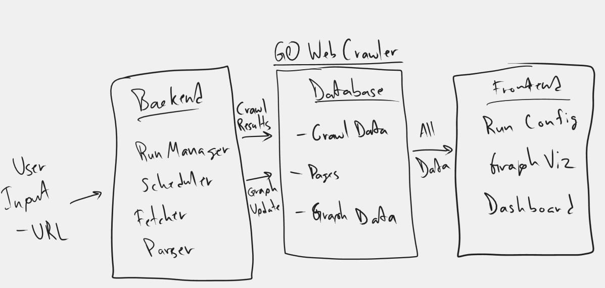

# Web Crawler in Go

> **Status**: Active build. Production-style crawler core + live dashboard.

A high-performance crawler in Go with a real-time dashboard that makes throughput, queue behavior, and failures legible while the crawl runs. The goal is **fast + bounded + explainable** crawling on messy web conditions.



## Repo Structure
- `backend/` Go API + crawler engine
- `frontend/` Next.js UI (TypeScript + React)
- `infra/` Docker Compose

## Quickstart (Docker)
From repo root:

```bash
docker compose -f infra/docker-compose.yml up --build
```

Then open:
- UI: http://localhost:3000
- API: http://localhost:8080
- Metrics: http://localhost:8080/metrics
- pprof: http://localhost:8080/debug/pprof/

## Local Dev (No Docker)
Backend:
```bash
cd backend
go run ./cmd/server
```

Optional: run without Postgres (in-memory only):
```bash
set DISABLE_DB=true
go run ./cmd/server
```

PowerShell syntax:
```powershell
$env:DISABLE_DB="true"
go run ./cmd/server
```

Frontend (Bun):
```bash
cd frontend
bun install
bun run dev
```

## Key Features
- Single shared `http.Client` + tuned transport for connection reuse.
- Bounded queues with backpressure (frontier/fetch/parse).
- Per-host concurrency + fairness.
- Redirect rescheduling (no politeness leaks).
- Timeouts + size caps + retry policy + circuit breaker.
- Streaming HTML tokenization (no DOM).
- Live dashboard over SSE.
- Prometheus-style metrics + pprof profiling.

## API Summary
See `API.md` for full details.

## Development Notes
- Use Bun for frontend package management.
- Update `README.md` when adding new top-level directories or commands.
- If you hit a hard blocker that needs user input, record it in `blocker.md`.
