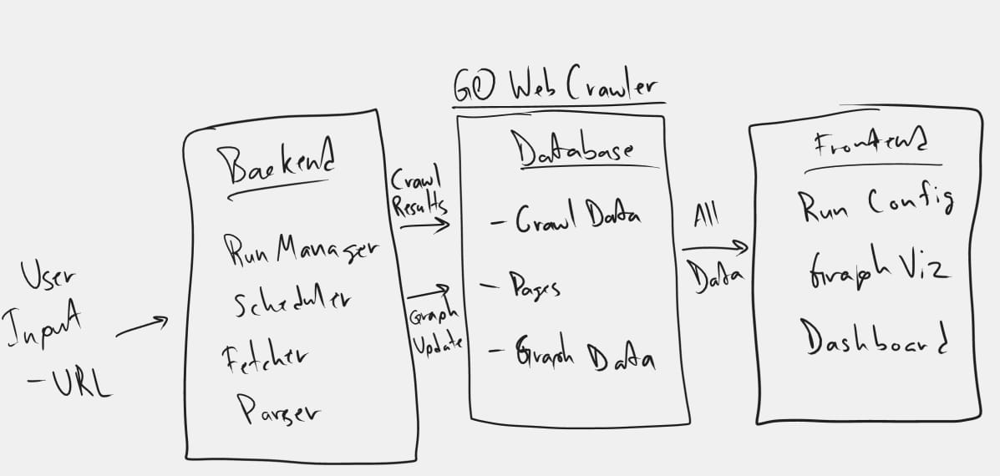

# Web Crawler in Go

> **Status**: Active build. Production-style crawler core + live dashboard.

A high-performance crawler in Go with a real-time dashboard that makes throughput, queue behavior, and failures legible while the crawl runs. The goal is **fast + bounded + explainable** crawling on messy web conditions.



## Repo Structure
- `backend/` Go API + crawler engine
- `frontend/` Next.js UI (TypeScript + React)
- `infra/` Docker Compose

## Quickstart (Docker)
From repo root:

```bash
docker compose -f infra/docker-compose.yml up --build
```

Then open:
- UI: http://localhost:3000
- API: http://localhost:8080
- Health: http://localhost:8080/healthz
- Ready: http://localhost:8080/readyz
- Metrics: http://localhost:8080/metrics
- pprof: http://localhost:8080/debug/pprof/

## Local Dev (No Docker)
Backend:
```bash
cd backend
go run ./cmd/server
```

Optional: run without Postgres (in-memory only):
```bash
set DISABLE_DB=true
go run ./cmd/server
```

PowerShell syntax:
```powershell
$env:DISABLE_DB="true"
go run ./cmd/server
```

Frontend (Bun):
```bash
cd frontend
bun install
bun run dev
bun run lint
bun run build
```

Backend checks:
```bash
cd backend
go test ./...
go vet ./...
```

## Key Features
- Single shared `http.Client` + tuned transport for connection reuse.
- Bounded queues with backpressure (frontier/fetch/parse).
- Per-host concurrency + fairness.
- Redirect rescheduling (no politeness leaks).
- Timeouts + size caps + retry policy + circuit breaker.
- Streaming HTML tokenization (no DOM).
- Live dashboard over SSE.
- Prometheus-style metrics + pprof profiling.
- Structured API errors with per-field validation feedback.
- Per-IP run creation rate limiting.
- Seed + discovered URL target protections (no localhost/private/reserved targets).
- Retention cleaner for short-lived run data (default 72h).

## API Summary
See `API.md` for full details.

## Launch Defaults (No Auth Soft-Launch)
- `max_pages <= 2000`
- `time_budget_seconds <= 300`
- `global_concurrency <= 32`
- `per_host_concurrency <= 4`
- `max_links_per_page <= 100`

## Deploy (Vercel + Railway)
### Frontend (Vercel)
- Deploy `frontend/`.
- Set env:
  - `NEXT_PUBLIC_API_BASE=https://<backend-domain>`

### Backend (Railway)
- Deploy `backend/` Dockerfile.
- Set env:
  - `PORT=8080`
  - `ALLOWED_ORIGINS=https://<vercel-domain>`
  - `ALLOWED_PREVIEW_SUFFIX=<optional-preview-domain-suffix>`
  - `DATABASE_URL=<railway-postgres-url>`
  - `RETENTION_HOURS=72`
  - `RUN_CREATE_RATE_LIMIT=10`
  - `RUN_CREATE_RATE_WINDOW=1m`
  - `DEFAULT_MAX_PAGES=2000`
  - `DEFAULT_TIME_BUDGET=5m`
  - `DEFAULT_MAX_LINKS_PER_PAGE=100`
  - `DEFAULT_GLOBAL_CONCURRENCY=32`
  - `DEFAULT_PER_HOST_CONCURRENCY=4`

## Smoke Checklist
- `POST /runs` rate limit returns 429 after threshold.
- Unsafe seed URLs are rejected with structured 4xx errors.
- `/healthz` returns 200 and `/readyz` reflects DB readiness.
- Dashboard transitions to terminal stopped state when run ends.

## Development Notes
- Use Bun for frontend package management.
- Update `README.md` when adding new top-level directories or commands.
- If you hit a hard blocker that needs user input, record it in `blocker.md`.
